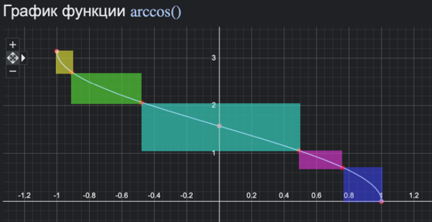

# unit-testing

## Текст задания.
1. Для указанной функции провести модульное тестирование разложения функции в степенной ряд. Выбрать достаточное тестовое покрытие.
• Функция arccos(x)
2. Провести модульное тестирование указанного алгоритма. Для этого выбрать характерные точки внутри алгоритма, и для предложенных самостоятельно наборов исходных
данных записать последовательность попадания в характерные точки. Сравнить последовательность попадания с эталонной.
• Программный модуль для поиска кратчайшего пути в ориентированном графе по
алгоритму Дейкстры (http://www.cs.usfca.edu/~galles/visualization/Dijkstra.
html)
3. Сформировать доменную модель для заданного текста. Разработать тестовое покрытие
для данной доменной модели
1.1 Описание предметной области.
Всех швырнуло к стенам, из которых тут же выскочили воздушные подушки. Несколько
секунд, прижатые к стенам силами инерции, они не могли пошевелиться и лишь хватали
ртами воздух. Зафод в отчаянии извернулся и, дотянувшись, пнул небольшой тумблер на
навигационной панели.

## Код.
[https://github.com/Kyoto67/vt-labs-3/tree/tpo-lab1](https://github.com/neikatya/unit-testing/tree/main/src)

## Обоснование выбора точек в пункте 1.

Были выбраны крайние точки (-1, 1), точка перегиба (0) и анализом эквивалентности были
выделены участки, на которых функция значительно меняет свое поведение (-0.9, -0.5, 0.5,
0.707)

